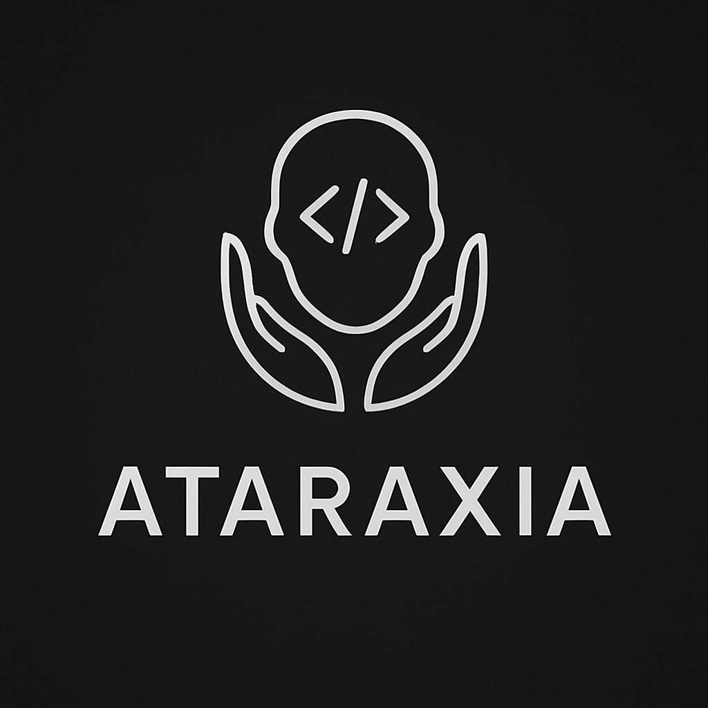

<div align="center">
  
  
  # Ataraxia
  
  **Ataraxia** - *Ancient Greek: ἀταραξία - "serene calmness"*
  
  
  
  
  
  
</div>

---

A comprehensive collection of security auditing agents designed for modern development workflows. Each agent specializes in language-specific security patterns and works with any LLM platform, optimized for Claude, providing immediate, actionable security feedback during development.

## ⚠️ Important Disclaimer

Ataraxia is designed as a **free and accessible shift-left security solution** to help developers produce higher quality, more secure code from the source. These agents are intended to complement, not replace, robust Static Application Security Testing (SAST) and Dynamic Application Security Testing (DAST) solutions.

**What Ataraxia does:**
- Reduces the number of vulnerabilities that reach production
- Improves the quality and accuracy of security findings when used alongside formal security tools
- Provides immediate, actionable feedback during development
- Educates developers on secure coding practices

**What Ataraxia does NOT do:**
- Replace comprehensive enterprise security scanning solutions
- Guarantee complete vulnerability coverage
- Provide compliance certifications or formal security assessments

Use Ataraxia as part of a layered security approach alongside your existing security toolchain.

## 🚀 Quick Start

### Method 1: Direct Loading
```bash
# Load an agent directly in Claude Code
@agents/python/python-security-agent.md
# Then provide code for analysis
```

### Method 2: Custom Slash Commands
Copy agent files to Claude Code commands directory for easy access:

```bash
# For global use across all projects
cp agents/python/python-security-agent.md ~/.claude/commands/
cp agents/go/go-security-agent.md ~/.claude/commands/
# ... repeat for other agents

# For project-specific use within your project root
mkdir -p .claude/commands/
cp agents/python/python-security-agent.md .claude/commands/
```

Then use as slash commands:
```bash
# Analyze entire codebase for Python security issues
/python-security-agent.md

# Analyze entire codebase for Go security issues  
/go-security-agent.md

# Works for any language agent you've copied
/rust-security-agent.md
```

## 🛡️ Available Agents

| Agent          | Language   | Specialization | Key Focus Areas                            |
| -------------- | ---------- | -------------- | ------------------------------------------ |
| **SentinelPy** | Python     | Security audit | Injection attacks, crypto, dependencies    |
| **SentinelGo** | Go         | Security audit | Concurrency, memory safety, HTTP security  |
| **IronGuard**  | Rust       | Security audit | Memory safety, unsafe code, borrowing      |
| **GuardianJS** | JavaScript | Security audit | XSS, prototype pollution, Node.js security |
| **TypeGuard**  | TypeScript | Security audit | Type safety, runtime validation            |
| **RubyShield** | Ruby       | Security audit | Rails security, meta-programming risks     |

## 📁 Repository Structure

```
ataraxia/
├── agents/
│   ├── python/
│   │   ├── python-security-agent.md
│   │   └── security_review_example/
│   ├── go/
│   │   ├── go-security-agent.md
│   │   └── security_review_example/
│   ├── rust/
│   │   ├── rust-security-agent.md
│   │   └── security_review_example/
│   ├── javascript/
│   │   ├── javascript-security-agent.md
│   │   └── security_review_example/
│   ├── typescript/
│   │   ├── typescript-security-agent.md
│   │   └── security_review_example/
│   └── ruby/
│       ├── ruby-security-agent.md
│       └── security_review_example/
├── CLAUDE.md          # Claude Code integration guide
└── README.md
```

## 🔧 LLM Integration

These agents are designed as portable prompts that work with any LLM platform:

- **Claude Code** (Recommended): Direct loading with `@agents/language/agent.md`
- **ChatGPT**: Copy agent content into conversation
- **Local LLMs**: Use with Ollama, LM Studio, or other local deployments
- **API Integration**: Incorporate into custom applications via LLM APIs
- **Enterprise Platforms**: Works with Azure OpenAI, AWS Bedrock, and similar services

## 🎯 Agent Features

Each security agent provides:

- **20+ Security Categories** - Comprehensive coverage of language-specific vulnerabilities including:
  - Input Validation & Injection Defense
  - Authentication & Authorization
  - Cryptographic Implementation
  - Session Management
  - Error Handling & Information Disclosure
  - File System Security
  - Network Security & HTTP Headers
  - Data Protection & Privacy
  - Dependency Management
  - Memory Safety & Resource Management
  - Concurrency & Race Conditions
  - Business Logic Security
  - API Security
  - Configuration Security
  - Logging & Monitoring
  - Third-Party Integration Security
  - Code Quality & Maintainability
  - Performance vs Security Tradeoffs
  - Compliance & Regulatory Requirements
  - Anti-Pattern Detection
- **4-Tier Risk Scoring** - CRITICAL (9-10), HIGH (7-8), MEDIUM (4-6), LOW (1-3)
- **Threat Modeling Integration** - Business impact categorization
- **Actionable Fixes** - Ready-to-use secure code patches
- **Tool Recommendations** - Appropriate security tools for each language
- **Detection Patterns** - Specific methods to identify vulnerabilities
- **Remediation Timelines** - Immediate/7-days/30-days prioritization

## 🛠️ Setup Instructions

### 1. Clone Repository
```bash
git clone <repository-url>
cd ataraxia
```

### 2. Using with Claude Code
1. Load agents directly: `@agents/python/python-security-agent.md`
2. Follow guidance in `CLAUDE.md` for integration details

## 🤝 Contributing

1. **Adding New Agents**: Follow the established format in existing agent files
2. **Extending Coverage**: Add new security categories or language support

## 📖 Documentation

- **`CLAUDE.md`** - Detailed Claude Code integration guide
- **Agent Files** - Each agent contains comprehensive usage documentation

## 🎖️ Security Focus

All agents prioritize:
- **Defense in Depth** - Multiple layers of security validation
- **Secure by Default** - Recommending safe patterns over convenient ones
- **Industry Standards** - Following OWASP, NIST, and language-specific guidelines
- **Practical Security** - Balancing security with development productivity

---

## Primary Contributors

**Ataraxia** was created by [Tyler Gallenbeck](https://x.com/TylerGallenbeck) in July of 2025.

[](https://x.com/TylerGallenbeck)

---

**Ataraxia** - *Ancient Greek: ἀταραξία - "serene calmness"*

Achieve peace of mind through comprehensive security analysis.